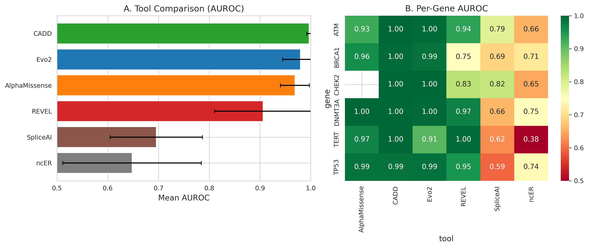

# Evo2 Zero-Shot Variant Effect Prediction for Spaceflight Genes

[](LICENSE)
[](https://www.python.org/downloads/)
[](https://github.com/ARC-Institute/evo2)
[](https://huggingface.co/datasets/jang1563/evo2-spaceflight-vep)

Zero-shot variant effect prediction across **coding and non-coding** regions of 10 spaceflight radiation-response genes using the [Evo2](https://github.com/ARC-Institute/evo2) genomic foundation model (7B parameters). Pre-computed scores for **215,000+ variants** are available on [Hugging Face](https://huggingface.co/datasets/jang1563/evo2-spaceflight-vep).

<p align="center">
  
</p>

## Key Results

| Gene | Variants | Evo2 AUROC | AlphaMissense | CADD | REVEL |
|------|----------|------------|---------------|------|-------|
| CHEK2 | 16,098 | **0.9996** | -- (n=8) | 0.999 | 0.832 |
| ATM | 52,791 | **0.9955** | 0.926 | 0.999 | 0.937 |
| DNMT3A | 19,693 | 0.996 | 1.000 | 1.000 | 0.972 |
| TP53 | 14,240 | **0.9887** | 0.988 | 0.988 | 0.952 |
| BRCA1 | 36,901 | 0.988 | 0.960 | 0.995 | 0.748 |
| TERT | 17,443 | 0.909 | 0.969 | 0.999 | 0.996 |
| **Mean** | | **0.980** | 0.969 | 0.997 | 0.906 |

**Bold** = highest AUROC among all tools for that gene. ClinVar P/LP vs B/LB (>=2-star review). 4 additional genes (CLOCK, NFE2L2, MSTN, RAD51) scored but lack sufficient ClinVar P/LP variants for AUROC.

**Highlights:**
- Evo2 achieves the **highest AUROC of any tool** for CHEK2 (0.9996) and TP53 (0.989)
- On ATM (52K variants), Evo2 outperforms AlphaMissense by **+0.069 AUROC**
- Radiation-type mutations (C>A via 8-oxoguanine) are more damaging than other mutations across **all 10 genes** (all p < 0.005; ATM p = 1.1e-26)
- Evo2 scores **complement** existing tools (Spearman rho 0.41--0.83 vs CADD), capturing distinct signal
- Non-coding validation: Spearman rho = -0.267 (p = 3.8e-14) against TERT promoter MPRA data

## Gene Panel

| Gene | Category | Spaceflight Relevance |
|------|----------|----------------------|
| **BRCA1** | DMS control | DNA repair; risk allele in [Rutter et al. 2024](https://doi.org/10.1038/s41467-024-50532-5) |
| **TP53** | DMS control | Most mutated gene in astronaut clonal hematopoiesis (7/14 astronauts) |
| **CHEK2** | DMS control | DNA damage checkpoint kinase |
| **DNMT3A** | DMS control | 2nd most mutated in astronaut CH; found in Inspiration4 crew |
| **TERT** | Novel target | Telomere biology; 14.5% elongation in NASA Twins Study |
| **ATM** | Novel target | DSB sensor for galactic cosmic ray (GCR) radiation damage |
| **NFE2L2** | Novel target | Master antioxidant TF; protective in 4 ISS mouse studies |
| **CLOCK** | Novel target | Circadian rhythm; 16 sunrises/day disruption on ISS |
| **MSTN** | Novel target | Muscle wasting protection in microgravity |
| **RAD51** | Novel target | Core HR recombinase for strand invasion at DSBs |

## Three-Layer Validation

1. **DMS Calibration** -- Spearman correlation with deep mutational scanning fitness scores (4 control genes); Pejaver 2022 likelihood ratio threshold calibration
2. **ClinVar Validation** -- Independent AUROC on ClinVar P/LP vs B/LB (>=2-star), stratified by review status, benchmarked against 5 tools
3. **Non-Coding Validation** -- TERT promoter MPRA (Kircher 2019), ENCODE cCRE enrichment analysis

## Pre-Computed Scores

All variant scores are available on Hugging Face:

```python
from datasets import load_dataset
ds = load_dataset("jang1563/evo2-spaceflight-vep")

# Filter to a specific gene
atm = ds.filter(lambda x: x["gene"] == "ATM")

# Get pathogenic variants
pathogenic = ds.filter(lambda x: x["clinvar_class"] == "Pathogenic")
```

Each variant includes: `chrom`, `pos`, `ref`, `alt`, `gene`, `region_type`, `delta` (Evo2 score), `clinvar_class`, `clinvar_stars`.

## Repository Structure

```
scripts/
  00_window_ablation.py       # Window size ablation (4K--64K bp)
  01_prepare_variants.py      # Generate variant sequences (SNVs + indels)
  02_score_variants.py        # Evo2 scoring engine with checkpointing
  03_calibrate_dms.py         # DMS calibration + Pejaver LR thresholds
  04_validate_clinvar.py      # ClinVar validation + temporal split
  05_score_noncoding.py       # TERT MPRA + ENCODE enrichment
  06_score_indels.py          # Indel scoring (in-frame vs frameshift)
  07_benchmark_tools.py       # Multi-tool comparison (AM, CADD, REVEL, etc.)
  08_radiation_signatures.py  # Radiation mutation functional impact
  09_cross_species.py         # Mouse ortholog scoring (GRCm39)
  10_entropy_landscape.py     # Positional entropy landscape
  11_astronaut_variants.py    # Published astronaut mutation scoring
  12_make_figures.py          # Figure generation
  utils/                      # Config, gene coordinates, parsers, benchmarking
  slurm/                      # SLURM job templates for HPC
data/
  download_data.sh            # Automated data download script
figures/                      # Pre-rendered figures
results/                      # Example result files
```

## Installation

### Requirements

- Python >= 3.11
- CUDA-capable GPU with >= 48 GB VRAM (A40 or A100)
- PyTorch >= 2.5 with CUDA 12.1+

### Setup

```bash
# Create environment
conda create -n evo2 python=3.11 -y
conda activate evo2

# Install Evo2
pip install evo2 torch flash-attn

# Install analysis dependencies
pip install -r requirements.txt
```

### Quick Start

```bash
# Set your project root
export EVO2_ROOT=/path/to/your/project

# 1. Download reference data and benchmarks
bash data/download_data.sh

# 2. Download DMS data from MaveDB
python scripts/download_mavedb.py

# 3. Prepare variants for a gene
python scripts/01_prepare_variants.py --gene BRCA1

# 4. Score variants (requires GPU)
python scripts/02_score_variants.py --gene BRCA1 --window-size 8192

# 5. Validate against ClinVar
python scripts/04_validate_clinvar.py --gene BRCA1

# 6. Run full benchmark
python scripts/07_benchmark_tools.py --gene all

# 7. Generate figures
python scripts/12_make_figures.py --fig all
```

For SLURM-based HPC environments, see `scripts/slurm/template.sh`.

## Scoring Method

```
score(S) = (1/N) * SUM log P(s_{t+1} | s_1, ..., s_t)
delta    = score(S_alt) - score(S_ref)
```

- More negative delta = more damaging variant
- All scores use reverse-complement averaging for strand symmetry
- Window size: 8,192 bp (optimal via ablation; AUROC 0.992 across 3 genes x 4 sizes)
- Deterministic at bfloat16 precision

## Figures

<details>
<summary>Click to expand all figures</summary>

| Figure | Description |
|--------|-------------|
| Fig 2 | Window size ablation: AUROC vs window size, score stability |
| Fig 3 | DMS calibration: Evo2 vs DMS fitness (4 control genes) |
| Fig 4 | ClinVar validation: multi-tool AUROC comparison (6 genes) |
| Fig 5 | Per-gene constraint landscapes (all 10 genes) |
| Fig 6 | Non-coding: TERT MPRA correlation, ENCODE cCRE enrichment |
| Fig 7 | Radiation mutation impact across 10 genes |
| Fig 8 | Astronaut variant scoring |
| S1 | Tool orthogonality matrix |
| S3 | Frameshift vs in-frame indel analysis |

</details>

## Data Sources

| Dataset | Source | Build |
|---------|--------|-------|
| Reference genome | GRCh38 no-alt analysis set | hg38 |
| ClinVar | NCBI ClinVar VCF | hg38 |
| BRCA1 DMS | [Findlay 2018](https://doi.org/10.1038/s41586-018-0461-z) (MaveDB `00000097-0-2`) | -- |
| TP53 DMS | [Giacomelli 2018](https://doi.org/10.1038/s41588-018-0204-y) (MaveDB `00000068-b-1`) | -- |
| CHEK2 DMS | [McCarthy-Leo 2024](https://doi.org/10.1016/j.ajhg.2024.04.003) (MaveDB `00001203-a-1`) | -- |
| DNMT3A DMS | [Garcia et al. 2025](https://doi.org/10.1101/2025.09.24.678339) | -- |
| TERT MPRA | [Kircher 2019](https://doi.org/10.1038/s41467-019-11526-w) (MaveDB `00000031-b-1`) | -- |
| AlphaMissense | [Cheng et al. 2023](https://doi.org/10.1126/science.adg7492) | hg38 |
| CADD | [v1.7, Rentzsch et al. 2021](https://doi.org/10.1093/nar/gkaa1018) | hg38 |
| REVEL | [v1.3, Ioannidis et al. 2016](https://doi.org/10.1016/j.ajhg.2016.08.016) | hg38 |
| ENCODE cCREs | [ENCODE Project](https://doi.org/10.1038/s41586-020-2493-4) | hg38 |

## Citation

```bibtex
@software{kim2026evo2vep,
  title={Evo2 Zero-Shot Variant Effect Prediction for Spaceflight Radiation-Response Genes},
  author={Kim, JangKeun and Mason, Christopher E.},
  year={2026},
  url={https://github.com/jang1563/evo2-spaceflight-vep}
}
```

Please also cite the Evo2 model:

```bibtex
@article{nguyen2026evo2,
  title={Sequence modeling and design from molecular to genome scale with Evo 2},
  author={Nguyen, Eric and others},
  journal={Nature},
  year={2026},
  doi={10.1038/s41586-026-10176-5}
}
```

## Related Work

- [Evo2](https://github.com/ARC-Institute/evo2) -- Genomic foundation model (ARC Institute)
- [Rutter et al. 2024](https://doi.org/10.1038/s41467-024-50532-5) -- Protective alleles for spaceflight (*Nature Communications*)
- [SOMA Atlas](https://doi.org/10.1038/s41586-024-07639-y) -- Space Omics and Medical Atlas (*Nature*)
- [Brojakowska et al. 2022](https://doi.org/10.1038/s42003-022-03777-z) -- Astronaut clonal hematopoiesis (*Communications Biology*)

## License

MIT License. See [LICENSE](LICENSE) for details.
